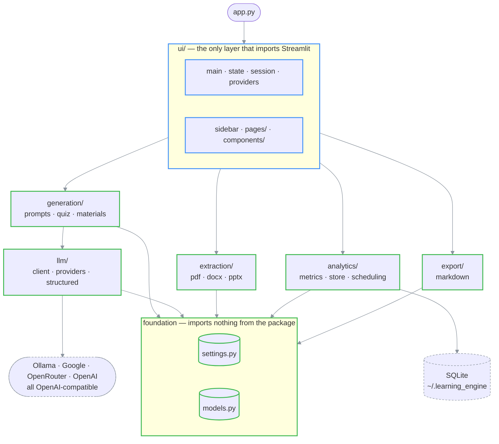
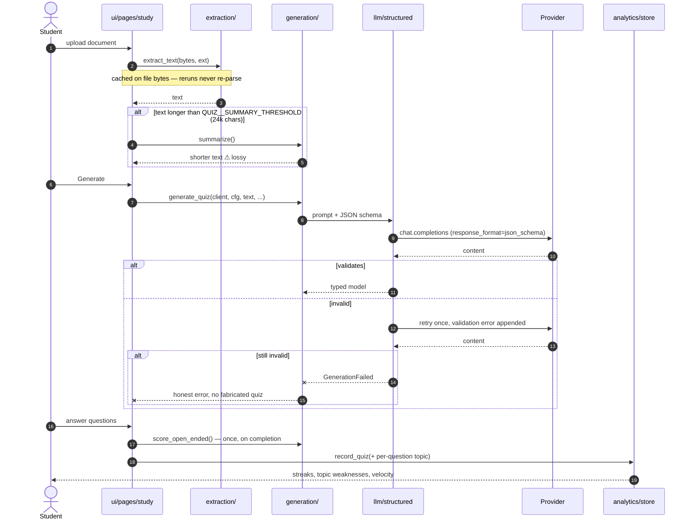

# 📚 AI Learning Engine

Turn a PDF, Word, or PowerPoint file into an interactive quiz or a set of study materials, using a
local model on your own machine or a cloud provider. Built as a personal study tool during
university, then rebuilt into something other people can run.

> **What this is:** the front door — what the app does, how to run it, how it is put together, and
> where it is still rough.
> **How to read it:** [It costs nothing to run](#it-costs-nothing-to-run) → [Run it](#run-it) →
> [What it does](#what-it-does) → [How it works](#how-it-works) (architecture, then the request
> flow) → [Configuration](#configuration) → [Known sharp edges](#known-sharp-edges).
> **Companions:** [`docs/modernization/`](docs/modernization/) — the audit, the target
> architecture, and the 9-phase plan this codebase was rebuilt against.
> **Verify with:** `uv run pytest` (236 tests) · `uv run ruff check .` · `uv run mypy`
> **Reflects code as of:** 2026-07-25 (`a544573`, branch `main`).

---

## It costs nothing to run

**Three of the four providers are free, and none of them need a credit card.** Every feature in
this README — quizzes, marking, study materials, analytics, spaced repetition — works on a budget
of zero.

| Route | Cost | What you give up |
| --- | --- | --- |
| **Ollama**, local | Free forever, no key, no account | Runs on your own hardware: a small model is weaker, a big one is slow |
| **Google AI Studio** | Free tier, no card | A daily request cap |
| **OpenRouter** | Free tier, no card | A daily request cap |
| OpenAI | Pay-per-use | — |

Google AI Studio and OpenRouter are **separate accounts with separate allowances**, so holding both
gives you two independent daily budgets. The sidebar switches between them mid-session, with no
restart and no config edit — when one is exhausted, change the dropdown and carry on.

On OpenRouter the app defaults to `google/gemma-4-31b-it:free`. **The `:free` suffix is what keeps
the key unbilled** — the same model without it is a paid route.

> ⚠ **The daily caps are deliberately not written down here.** Both providers change them at short
> notice, and a number in a README outlives its accuracy — Google cut its free Gemma quota in July
> 2026. Read them from the source instead:
> [Google's rate limits](https://ai.google.dev/gemini-api/docs/rate-limits) ·
> [OpenRouter's rate limits](https://openrouter.ai/docs/api_reference/limits). Plan on "enough for
> normal study use", not "enough to hammer".

---

## Run it

Pick one. All three end with the app on <http://localhost:8501>.

### Docker — nothing to install but Docker

```bash
git clone https://github.com/EzzoHamdan/AI-Learning-Engine
cd AI-Learning-Engine
docker compose up
```

Reaches an Ollama already running on your machine via `host.docker.internal`. To run the model
server in a container too:

```bash
LLM__OLLAMA__HOST=ollama docker compose --profile ollama up
```

Analytics live in a named volume, so streaks and flashcard schedules survive `docker compose down`.

### uv — for development

```bash
uv sync
uv run streamlit run app.py
```

### pip

```bash
python -m venv .venv && source .venv/bin/activate   # Windows: .venv\Scripts\activate
pip install -e .
streamlit run app.py
```

Python 3.11+. Tested on Linux, macOS, and Windows in CI.

### Getting a model

The app needs at least one provider. All but the last of these are free — see
[It costs nothing to run](#it-costs-nothing-to-run).

**Local, private, no key** — [Ollama](https://ollama.ai):

```bash
ollama serve
ollama pull gemma2:2b     # ~2GB RAM; 9b and 27b are better and slower
```

**Free tier, no card** — grab a key from
[Google AI Studio](https://aistudio.google.com/app/apikey) or
[OpenRouter](https://openrouter.ai/keys), then either paste it into the sidebar for the current
session or set it in `.env` to persist:

```bash
GOOGLE_AI_API_KEY=...       LLM__DEFAULT_PROVIDER=google
OPENROUTER_API_KEY=...      LLM__DEFAULT_PROVIDER=openrouter
```

**Paid** — [OpenAI](https://platform.openai.com/api-keys), same two options, `OPENAI_API_KEY`.

Keys are never written to disk by the app: a sidebar key lives for that session only, and a `.env`
key is read from your environment.

---

## What it does

| Input | Output |
| --- | --- |
| PDF / DOCX / PPTX, up to 50MB | Multiple choice, true/false, open-ended, or a mix |
| | Study guide, summary, cheat sheet, flashcards, outline, key terms |
| | Markdown download of any generated material, or of the quiz with an answer key |

Open-ended answers are marked by the model against a rubric it generated alongside the question.
When marking is unavailable, the app falls back to keyword matching **and labels the score
`estimated`** rather than passing a guess off as real marking.

Three difficulty levels (Standard, Advanced, Extreme) change both the questions asked and the score
bands used to interpret the result — 70% on Extreme is reported more favorably than 70% on
Standard.

### Analytics

Results persist to SQLite at `~/.learning_engine/analytics.db`, so streaks and progress survive a
browser refresh. The dashboard toggles between **This session** and **All time**.

Questions are tagged with the concept they test at generation time, so weaknesses read
"Calvin cycle needs review (25%)" rather than "needs improvement in mcq questions". A topic must be
seen at least twice before it is judged, so one unlucky question is not a weakness.

Flashcards are scheduled with [SM-2](https://super-memory.com/english/ol/sm2.htm), the algorithm
behind Anki: grading a card Easy / Hard / Forgot sets when it comes back. Scheduling is keyed on a
hash of the card's question text, so regenerating a deck for the same document keeps the history it
already earned.

---

## How it works

### Architecture

Dependencies point one way. Nothing below `ui/` imports Streamlit, which is what makes the
generation, extraction, and analytics logic testable without a browser — and it is enforced by a
test, not by convention ([`tests/test_architecture.py`](tests/test_architecture.py)).

```text
                    ┌──────────────────────────────────────────────┐
   app.py ─────────▶│  ui/            the ONLY layer importing st  │
   (2-line          │  main · state · session · providers          │
    launcher)       │  sidebar · pages/ · components/              │
                    └───────┬──────────────────────────┬───────────┘
                            │                          │
                 ┌──────────▼─────────┐    ┌───────────▼───────────┐
                 │  generation/       │    │  analytics/           │
                 │  prompts · quiz    │    │  metrics (pure math)  │
                 │  materials         │    │  store (SQLite)       │
                 └──────────┬─────────┘    │  scheduling (SM-2)    │
                            │              └───────────┬───────────┘
              ┌─────────────▼────────┐  ┌──────────────▼──────┐
              │  llm/                │  │  extraction/        │
              │  client — ONE OpenAI │  │  pdf · docx · pptx  │
              │   client, all four   │  └──────────┬──────────┘
              │   providers          │             │      ┌────────────┐
              │  providers · struct- │             │      │  export/   │
              │   ured (schema +     │             │      │  markdown  │
              │   exactly 1 retry)   │             │      └─────┬──────┘
              └─────────────┬────────┘             │            │
                            │                      │            │
                    ┌───────▼──────────────────────▼────────────▼───────┐
                    │  settings.py (all config)  ·  models.py (schemas) │
                    │  these import nothing from the package            │
                    └───────────────────────────────────────────────────┘
```

#### Architecture (rendered)



> All four providers speak the OpenAI chat-completions protocol, so there is one client and one
> code path — the ~600 lines of hand-written compatibility wrappers this project used to carry are
> gone. Provider differences are data: a base URL, a key, two model names
> ([`llm/providers.py`](src/learning_engine/llm/providers.py)). Adding OpenRouter was four entries
> in that table and no new code path, which is the point of the design.

### Request flow: document to graded quiz

```text
  upload ──▶ extract ──▶ [>24k chars?] ──▶ generate ──▶ answer ──▶ finalize ──▶ analytics
             (cached      │        yes         │                      │
              on bytes)   └──▶ summarize ──────┘                      │
                               ⚠ lossy                                │
                                                                      │
   generate:  prompt + JSON schema ──▶ model                          │
                    │                    │                            │
                    │              validate against Pydantic          │
                    │                    │                            │
                    │              ok ───┴─── invalid                 │
                    │              │            │                     │
                    │              │      retry ONCE, validation      │
                    │              │      error fed back to model     │
                    │              │            │                     │
                    │              │      still invalid               │
                    │              │            ▼                     │
                    │              │      GenerationFailed            │
                    │              │      (reported, never faked)     │
                    ▼              ▼                                  ▼
              typed model ───────────────────────────────▶  score ONCE, write
                                                             SQLite + session
```

#### Request flow (rendered)



> Scoring and analytics run **once**, on the transition into the completed state
> ([`ui/components/results.py::finalize_quiz`](src/learning_engine/ui/components/results.py)).
> They used to re-run on every Streamlit rerun, which re-billed the API and inflated the quiz count
> on every click.

### Code map

| Concern | Source |
| --- | --- |
| Entry point | [`app.py`](app.py) → [`ui/main.py`](src/learning_engine/ui/main.py) |
| All configuration | [`settings.py`](src/learning_engine/settings.py) |
| LLM output schemas | [`models.py`](src/learning_engine/models.py) |
| One client, all providers | [`llm/client.py`](src/learning_engine/llm/client.py), [`llm/providers.py`](src/learning_engine/llm/providers.py) |
| Schema-validated generation | [`llm/structured.py`](src/learning_engine/llm/structured.py) |
| Prompts (single source) | [`generation/prompts.py`](src/learning_engine/generation/prompts.py) |
| Quiz + open-ended scoring | [`generation/quiz.py`](src/learning_engine/generation/quiz.py) |
| Study materials | [`generation/materials.py`](src/learning_engine/generation/materials.py) |
| Streaks, velocity, topics | [`analytics/metrics.py`](src/learning_engine/analytics/metrics.py) |
| Persistence + migrations | [`analytics/store.py`](src/learning_engine/analytics/store.py) |
| Spaced repetition | [`analytics/scheduling.py`](src/learning_engine/analytics/scheduling.py) |
| Markdown export | [`export/markdown.py`](src/learning_engine/export/markdown.py) |
| Session state (one home per key) | [`ui/state.py`](src/learning_engine/ui/state.py) |
| Architecture rules, enforced | [`tests/test_architecture.py`](tests/test_architecture.py) |

---

## Configuration

Everything is a field in [`settings.py`](src/learning_engine/settings.py) and overridable from the
environment. Names are grouped by prefix — `LLM__`, `QUIZ__`, `APP__` — with `__` separating nested
sections. API keys and deployment flags keep their conventional unprefixed names.
[`.env.example`](.env.example) is the complete list.

| Variable | Default | What it controls |
| --- | --- | --- |
| `LLM__DEFAULT_PROVIDER` | `ollama` | Which provider the app starts on: `ollama`, `google`, `openrouter`, `openai` |
| `LLM__OLLAMA__CHAT_MODEL` | `gemma2:2b` | Local model used for generation |
| `LLM__OLLAMA__HOST` / `__PORT` | `127.0.0.1` / `11434` | Where Ollama is listening |
| `LLM__GOOGLE__CHAT_MODEL` | `gemini-2.5-flash` | Gemini model, via its OpenAI-compatible endpoint |
| `LLM__OPENROUTER__CHAT_MODEL` | `google/gemma-4-31b-it:free` | OpenRouter model — keep `:free` to stay unbilled |
| `LLM__OPENAI__CHAT_MODEL` | `gpt-4o-mini` | OpenAI model |
| `LLM__GENERATION_TEMPERATURE` | `0.7` | Question generation |
| `LLM__SCORING_TEMPERATURE` | `0.3` | Open-ended marking |
| `LLM__REQUEST_TIMEOUT` | `120` | Seconds per generation call |
| `QUIZ__SUMMARY_THRESHOLD` | `24000` | Characters above which a document is condensed first |
| `QUIZ__MAX_UPLOAD_MB` | `50` | Upload limit, enforced before parsing |
| `QUIZ__MIN/MAX/DEFAULT_QUESTIONS` | `3` / `15` / `5` | Slider bounds |
| `OPENAI_API_KEY`, `GOOGLE_AI_API_KEY`, `OPENROUTER_API_KEY` | — | Cloud provider keys |
| `DEBUG` | `false` | Provider/status diagnostics in the page |
| `DEPLOYED` | `false` | Set `true` when hosting, so Streamlit secrets are read |
| `LEARNING_ENGINE_DB` | `~/.learning_engine/analytics.db` | Where analytics are stored |

To change the model without touching a file:

```bash
LLM__OLLAMA__CHAT_MODEL=llama3.2 uv run streamlit run app.py
```

> The pre-`LLM__` names (`LOCAL_AI_MODEL`, `LOCAL_AI_HOST`, `LOCAL_AI_PORT`, and
> `USE_LOCAL_AI` / `USE_GOOGLE_AI` / `USE_OPENAI`) are still honored so existing `.env` files keep
> working, but the prefixed names take precedence and are the ones to use.

---

## What never happens

Negative guarantees, each covered by a test:

- **A failed generation never becomes fake content.** No placeholder quiz, no invented flashcard —
  it raises, and the UI says so ([`tests/test_structured.py`](tests/test_structured.py)).
- **A keyword-estimated score is never presented as AI marking.** It carries `estimated=True` and a
  visible badge ([`tests/test_scoring.py`](tests/test_scoring.py)).
- **The app never switches providers behind your back.** An unavailable provider is reported with
  its reason rather than silently replaced.
- **API keys are never written to disk.** They are session-scoped, or read from the environment or
  Streamlit secrets.
- **Nothing below `ui/` imports Streamlit** — checked by parsing the AST, so a lazy import inside a
  function is caught too.
- **A blank open-ended answer never costs an API call.**

---

## Development

```bash
uv sync                    # install, including dev dependencies
uv run pytest              # 236 tests, ~1s
uv run ruff check .        # lint
uv run ruff format .       # format
uv run mypy                # types — green across all 38 modules
```

CI runs all four on Linux, macOS, and Windows across Python 3.11–3.13, then boots the real
Streamlit app and fails on a traceback, then builds the Docker image and checks that the container
serves ([`.github/workflows/ci.yml`](.github/workflows/ci.yml)).

`tests/fixtures/` holds **raw responses captured from a live model**, saved before any parsing.
They are the regression corpus: they fail if a schema change stops accepting output a real model
actually produces. Do not hand-edit them, or they stop being evidence.

---

## Known sharp edges

Honest list. None of these are secretly fixed.

- ⚠ **The upload widget says "200MB per file".** That is Streamlit's own `server.maxUploadSize`,
  which cannot be set from Python at runtime. The real limit is `QUIZ__MAX_UPLOAD_MB` (50MB),
  enforced at extraction time with a clear error — so a 100MB file uploads, then gets rejected.
- ⚠ **Summarization is lossy and cannot tell you what it dropped.** Past
  `QUIZ__SUMMARY_THRESHOLD` the document is condensed before generation, and questions can only
  cover what survived. The UI says so; it cannot say *which* details went.
- ⚠ **Topic quality depends on the model.** Small local models sometimes emit near-duplicate topic
  names ("Calvin cycle" and "the Calvin cycle") that then count as separate topics.
- ⚠ **The Docker image is ~1GB.** PyMuPDF, pandas, numpy, plotly and Streamlit dominate it; there
  is no slimming trick that keeps all five.
- ⚠ **Spaced repetition has no dedicated review page yet.** Scheduling is recorded and the deck
  header shows how many cards are due, but you still study the deck you just generated rather than
  a cross-document due queue.
- ⚠ **Analytics are single-user and local.** There are no accounts; the database is one file on
  your machine.

---

## Privacy

| Provider | Where your document goes |
| --- | --- |
| Local AI (Ollama) | Nowhere. It stays on your machine. |
| Google AI / OpenAI | To that provider's API over TLS, subject to their retention policy. |
| OpenRouter | To OpenRouter, then on to whichever upstream host serves the model — two parties, not one. Free models in particular may be logged for training; check the model's page. |

No usage tracking, no telemetry, no accounts. The analytics database is local, and can be exported
or deleted from the dashboard.

---

## Troubleshooting

| Symptom | Likely cause | Fix |
| --- | --- | --- |
| "Local AI (Ollama) unavailable: Server not running" | Ollama isn't started | `ollama serve` |
| "Running but no models installed" | Server up, nothing pulled | `ollama pull gemma2:2b` |
| "API key not provided" | No key for the selected cloud provider | Paste it in the sidebar, or set it in `.env` |
| "Could not generate a valid quiz" after retry | Model too small to produce valid JSON | Use a larger model, or switch provider |
| Generation fails with a 429 / "rate limit" | The free tier's daily or per-minute cap is spent | Wait for the reset, or switch to the other free provider in the sidebar — the allowances are independent |
| Container can't reach Ollama | `host.docker.internal` not resolving (Linux) | Already mapped in `docker-compose.yml`; with plain `docker run`, add `--add-host=host.docker.internal:host-gateway` |
| Analytics empty after a quiz | DB path not writable | Check `LEARNING_ENGINE_DB` — persistence failures are logged, never raised |

Set `DEBUG=true` for provider diagnostics in the page, and check the terminal for the full log.

---

## Project history

This started as a personal study tool. It worked, but it was a 1,700-line `app.py` with no tests,
no packaging, three hand-written provider wrappers, seven copies of a regex JSON parser, and
analytics that erased themselves on every refresh. It was rebuilt in nine phases: bugs first, then
packaging, one LLM client, structured output, the UI split, persistence, settings, tests and CI,
and finally the feature backlog.

The audit, the target architecture, and the phase-by-phase plan are in
[`docs/modernization/`](docs/modernization/) — worth reading if you want the reasoning rather than
the result.

---

## License

GNU GPL v3 — see [LICENSE](LICENSE).

Built with [Streamlit](https://streamlit.io), [Ollama](https://ollama.ai), and
[Pydantic](https://docs.pydantic.dev). Made for students, by one.
